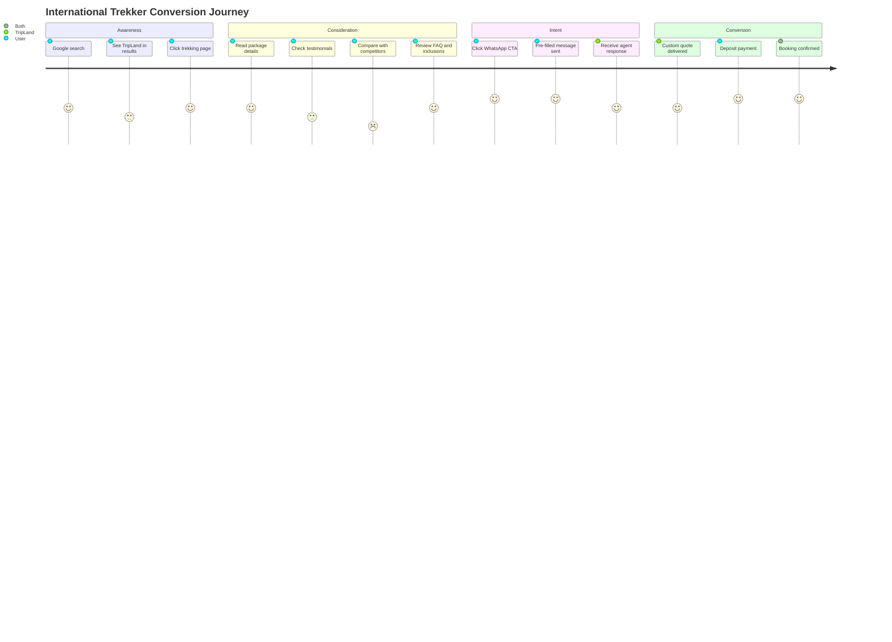
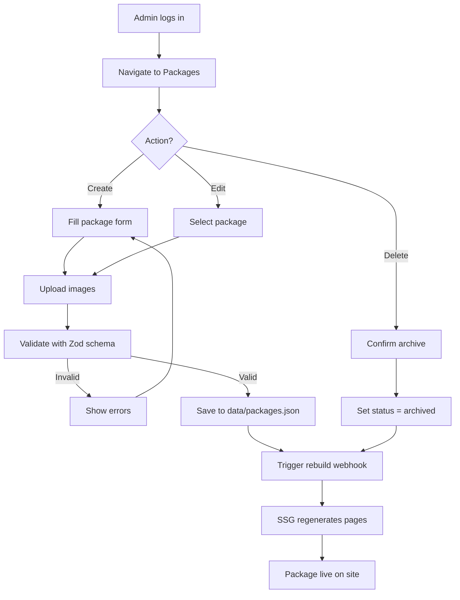
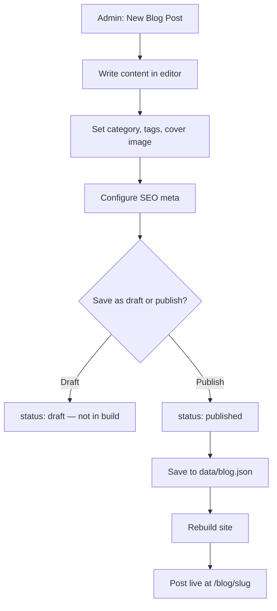
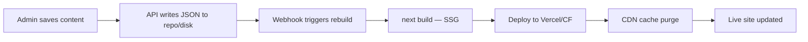

# Trip Land Travels & Tours — Product Requirements Document (PRD)

**Document Version:** 1.0  
**Date:** June 20, 2026  
**Prepared For:** UI/UX Design Team · Next.js Development Team  
**Client:** Trip Land Travels & Tours Pvt. Ltd.  
**Project Codename:** TripLand Premium Web Platform  

---

## Table of Contents

1. [Executive Summary](#1-executive-summary)
2. [Competitor Analysis](#2-competitor-analysis)
3. [Business Analysis](#3-business-analysis)
4. [User Personas](#4-user-personas)
5. [User Journey Maps](#5-user-journey-maps)
6. [Website Sitemap](#6-website-sitemap)
7. [Information Architecture](#7-information-architecture)
8. [Content Architecture](#8-content-architecture)
9. [Complete PRD](#9-complete-prd)
10. [Functional Requirements](#10-functional-requirements)
11. [Non-Functional Requirements](#11-non-functional-requirements)
12. [Admin Dashboard Requirements](#12-admin-dashboard-requirements)
13. [Package Management Workflow](#13-package-management-workflow)
14. [Blog Management Workflow](#14-blog-management-workflow)
15. [SEO Strategy](#15-seo-strategy)
16. [Conversion Funnel](#16-conversion-funnel)
17. [Lead Generation System](#17-lead-generation-system)
18. [Technical Recommendations](#18-technical-recommendations)
19. [Risks & Mitigation](#19-risks--mitigation)
20. [Future Scalability Roadmap](#20-future-scalability-roadmap)

---

# 1. Executive Summary

## 1.1 Project Vision

Trip Land Travels & Tours Pvt. Ltd. requires a **premium, inquiry-driven digital flagship** that positions the brand as Nepal's trusted luxury travel concierge — not a discount booking portal. The website will serve as a high-conversion trust engine that showcases curated Nepal and international experiences, captures qualified leads, and reinforces brand authority across organic search, social channels, and direct referrals.

## 1.2 Strategic Positioning

| Dimension | Current Market Gap | TripLand Opportunity |
|-----------|-------------------|----------------------|
| Visual Quality | Competitors use generic WordPress templates | Cinematic, editorial luxury aesthetic |
| Nepal Depth | International agencies lack Himalayan expertise narrative | Dual authority: Nepal specialist + global outbound |
| Conversion | Booking widgets create friction; luxury buyers want human consultation | Concierge-style inquiry flows with WhatsApp-first CTAs |
| Trust | Licenses buried in footers | Prominent NATTA/NTB credentials, executive visibility, real testimonials |
| Performance | Slow, carousel-heavy sites | Next.js 15 SSG, Lighthouse 95+, sub-2s LCP |

## 1.3 Success Metrics (12-Month Targets)

| KPI | Target |
|-----|--------|
| Monthly qualified inquiries | 150+ |
| WhatsApp click-through rate | 8%+ of sessions |
| Contact form completion rate | 4%+ |
| Organic traffic growth | 40% YoY |
| Average session duration | 3:30+ minutes |
| Mobile conversion rate | ≥ 70% of desktop rate |
| Lighthouse Performance | 95+ |
| Newsletter signups | 500/month |

## 1.4 Scope Summary

- **In Scope:** Marketing website, JSON-based CMS admin, 18+ page templates, package/blog/testimonial management, lead capture, SEO foundation, analytics integration
- **Out of Scope:** Online payment, real-time booking engine, multi-admin roles, database backend, customer login portal, flight GDS integration

---

# 2. Competitor Analysis

## 2.1 Sasa Travels (sasatravels.com)

### Profile
- Location: Gyaneshwor-30, Kathmandu (Gita Complex, 2nd Floor)
- Focus: International outbound (USA, UK, Japan, Australia, Canada)
- Contact: info@sasatravels.com · +977 9851163147

### Strengths
- Clean section-based homepage structure
- Destination categorization with tour counts
- Testimonials with named customers and cities
- Blog and photo gallery sections
- Service blocks (flight ticketing, hotel booking, adventure tours)
- Social proof counters and "Why Choose Us" narrative

### Weaknesses
- **Generic template aesthetic** — lacks luxury differentiation
- **Minimal Nepal inbound depth** — primarily international positioning
- **Compromised site integrity** — About page shows unrelated spam content (trust risk)
- **Carousel-heavy UX** — dated interaction patterns
- **Weak package detail pages** — thin itinerary and inclusion data
- **No WhatsApp-native lead flow**
- **Limited SEO depth** — shallow content architecture
- **No visible licensing/affiliation badges** above the fold

### TripLand Differentiation
> TripLand will own the **Nepal luxury + international concierge** positioning Sasa does not serve, with editorial photography, deep itinerary content, and executive-led trust signals.

---

## 2.2 Pangolin Travels (pangolintravels.com)

### Profile
- Established: 2020
- Focus: Flights, hotels, holiday packages — transactional one-stop shop
- Affiliations: NTB License, IATA, Nepal Government Registration
- Contact: info@pangolintravels.com · +977 9851118863 (24/7 helpline)

### Strengths
- Strong operational credentials (IATA, NTB license displayed)
- 24/7 support messaging
- Multi-service positioning (flights + hotels + holidays)
- Domestic and international flight deal sections
- Blog presence
- Newsletter subscription

### Weaknesses
- **Cluttered, transactional UI** — feels like an OTA, not a luxury brand
- **Flight search widgets dominate** — wrong mental model for premium inquiry
- **No immersive storytelling** — lacks emotional destination narrative
- **Weak visual hierarchy** — repetitive carousel banners, promotional noise
- **Sign-in/sign-up complexity** — unnecessary for lead-gen site
- **Visitor counter gimmick** — undermines premium perception
- **Minimal trekking/package depth** — deal-focused, not experience-focused
- **Poor mobile information density**

### TripLand Differentiation
> TripLand replaces transactional clutter with **curated editorial journeys**, keeping flight/visa as supporting services — not homepage heroes.

---

## 2.3 Aspirational Benchmarks (Premium Nepal Market)

| Agency | What They Do Well | Lesson for TripLand |
|--------|-------------------|---------------------|
| Luxury Holidays Nepal | Modern stack feel, detailed luxury trek pages, TripAdvisor badges, helicopter upsells | Package page depth + trust badge placement |
| Royal Mountain Travel | Sustainability story, community tourism, expert authority | Authentic Nepal narrative beyond sales copy |
| Places Nepal | Structured pricing tiers, group vs private, clear inclusions | Transparent "starting from" pricing on packages |

---

## 2.4 Competitive Feature Matrix

| Feature | Sasa | Pangolin | TripLand (Target) |
|---------|------|----------|-------------------|
| Luxury visual design | ★★☆☆☆ | ★☆☆☆☆ | ★★★★★ |
| Nepal trekking depth | ★☆☆☆☆ | ★★☆☆☆ | ★★★★★ |
| International packages | ★★★★☆ | ★★★★☆ | ★★★★★ |
| Package detail richness | ★★☆☆☆ | ★★☆☆☆ | ★★★★★ |
| Lead generation UX | ★★☆☆☆ | ★★★☆☆ | ★★★★★ |
| Mobile experience | ★★★☆☆ | ★★☆☆☆ | ★★★★★ |
| Performance | ★★☆☆☆ | ★★☆☆☆ | ★★★★★ |
| Admin content control | ★★☆☆☆ | ★★☆☆☆ | ★★★★☆ |
| SEO content architecture | ★★☆☆☆ | ★★☆☆☆ | ★★★★★ |
| Trust & credentials | ★★☆☆☆ | ★★★☆☆ | ★★★★★ |

---

## 2.5 Trip Land — Facebook & Brand Intelligence

> **Note:** Facebook content is partially restricted to authenticated sessions. The following is synthesized from NATTA registry, project brief, and observable social presence at `facebook.com/triplandtraveltours`.

### Company Identity

| Attribute | Detail |
|-----------|--------|
| Legal Name | Trip Land Travels & Tours Pvt. Ltd. |
| Executive Director | Mr. Vijay Jaiswal |
| NATTA Member ID | 881/24 |
| Office | Gaushala, Ratopul, Kathmandu, Nepal |
| Phone | +977-01-4599802 / 4599688 / 4562042 / 4562043 / 9851126300 |
| Email | triplandtravel@gmail.com · triplandtravel@live.com |
| Facebook | facebook.com/triplandtraveltours |
| Brand Tone (observed/inferred) | Approachable, service-oriented, multi-destination, community-engaged |

### Inferred Facebook Engagement Style
- Promotional package posts (seasonal offers, festival travel)
- Destination highlight imagery
- Direct inquiry encouragement via Messenger/phone
- Mix of Nepal inbound and international outbound content
- Visual-first posts with minimal long-form storytelling

### Brand Identity Recommendations for Web
- **Elevate** from social-media promotional tone to **editorial luxury**
- **Retain** warmth and accessibility — luxury without arrogance
- **Humanize** via Executive Director story and team credentials
- **Unify** visual language across web, Facebook, and WhatsApp templates

---

# 3. Business Analysis

## 3.1 Company Overview

Trip Land Travels & Tours is a Kathmandu-based, NATTA-registered travel agency offering comprehensive inbound Nepal experiences and outbound international holiday packages. The business operates as a **high-touch consultancy model** where personalized itinerary design, visa/flight assistance, and local expertise drive conversions — not self-serve checkout.

## 3.2 Service Portfolio

### Nepal Inbound
| Category | Core Offerings |
|----------|----------------|
| Trekking | Everest, Annapurna, Langtang, Mustang, Rara circuits |
| Hiking | Day hikes, short hill treks, family-friendly trails |
| Cultural & Heritage | Kathmandu Valley, Bhaktapur, Patan, living heritage tours |
| Luxury | Premium lodges, private guides, helicopter combinations |
| Pilgrimage | Lumbini, Muktinath, Pashupatinath, Gosainkunda |
| Adventure | Rafting, paragliding, bungee, peak climbing |
| Wildlife | Chitwan safari, Bardiya, Koshi Tappu birding |
| Helicopter | Everest view, Annapurna flyover, Muktinath charter |
| Family & Corporate | Custom group logistics, MICE, team retreats |

### International Outbound
Dubai · Thailand · Bali · Singapore · Malaysia · Japan · Europe

### Support Services
Flight booking assistance · Visa processing · Hotel reservations · Corporate travel management · Custom itinerary planning

## 3.3 Revenue Model

```
Visitor → Trust Building → Inquiry → Consultation → Custom Quote → Booking → Post-Trip Referral
```

- **No online payment** on website (Phase 1)
- Revenue from package margins, service fees, group commissions, corporate contracts
- Website role: **top-of-funnel qualification** and **brand authority**

## 3.4 Unique Value Propositions

1. **Dual-market expertise** — Nepal ground operations + international outbound from Kathmandu
2. **One concierge contact** — single agency for EBC trek AND Dubai holiday
3. **Local leadership** — Executive Director-led, Gaushala office, multi-line phone support
4. **Customization default** — every package positioned as tailorable, not fixed commodity
5. **NRN-specialized messaging** — Nepal diaspora travel needs (family visits + international side trips)

## 3.5 Business Goals → Digital Goals Mapping

| Business Goal | Digital Enabler |
|---------------|-----------------|
| Increase inbound trek inquiries | SEO-optimized trekking hub + detailed package pages |
| Grow international package sales | Destination landing pages with festival/season campaigns |
| Build corporate travel pipeline | Dedicated corporate page + LinkedIn-shareable case studies |
| Strengthen brand trust | Testimonials, licenses, team bios, transparent policies |
| Reduce dependency on walk-ins | WhatsApp + form capture with auto-acknowledgment |

---

# 4. User Personas

## Persona 1: International Tourist — "Sarah Mitchell"

| Attribute | Detail |
|-----------|--------|
| Age | 34 |
| Location | London, UK |
| Occupation | Marketing Manager |
| Income | £65,000/year |
| Travel Style | Curated adventure with comfort |

**Goals:** Trek Everest Base Camp safely; understand acclimatization; find a reliable local agency; avoid hidden costs.

**Pain Points:** Overwhelming agency choices; fear of unlicensed operators; unclear inclusions; time zone communication delays.

**Motivations:** Once-in-a-lifetime Himalayan experience; Instagram-worthy moments; authentic culture with safety net.

**Buying Behavior:** Researches 4–6 weeks; reads TripAdvisor and blogs; compares 3 agencies; books 2–3 months ahead; prefers email then WhatsApp.

**Device Usage:** 60% mobile (research), 40% desktop (deep comparison and form submission). iPhone, Chrome.

**User Journey:**
1. Google "Everest Base Camp trek best agency Nepal"
2. Lands on Trekking Packages → EBC page
3. Reviews itinerary, inclusions, difficulty, best season
4. Checks testimonials and FAQ
5. Submits inquiry form with travel dates
6. Continues conversation on WhatsApp
7. Receives custom quote → books via bank transfer

---

## Persona 2: Family Traveler — "Raj & Priya Sharma"

| Attribute | Detail |
|-----------|--------|
| Age | 38 & 36 |
| Location | Sydney, Australia (NRN connection) |
| Composition | 2 adults + 2 children (8, 12) |
| Travel Style | Comfort-first, educational, safe |

**Goals:** Introduce children to Nepal; combine Pokhara, Chitwan, and short trek; manage dietary needs; predictable logistics.

**Pain Points:** Child safety concerns at altitude; boring itineraries for kids; coordinating multi-city transport.

**Motivations:** Cultural roots connection; family bonding; school holiday timing.

**Buying Behavior:** Plans 2–4 months ahead; asks many questions; needs phone reassurance; books comprehensive package.

**Device Usage:** 70% mobile (Facebook discovery), 30% tablet (evening planning).

**User Journey:**
1. Discovers TripLand via Facebook family package post
2. Visits Family Tours page
3. Reads Chitwan + Pokhara combo package
4. Calls phone number directly
5. WhatsApp itinerary refinement
6. Books with deposit

---

## Persona 3: Adventure Traveler — "Marco De Luca"

| Attribute | Detail |
|-----------|--------|
| Age | 29 |
| Location | Milan, Italy |
| Occupation | Software Engineer |
| Travel Style | High-adrenaline, off-beaten-path |

**Goals:** Three Passes trek or Annapurna Circuit; maximize challenge; minimize bureaucratic friction.

**Pain Points:** Generic tourist routes; agencies pushing easy treks; gear and permit confusion.

**Motivations:** Personal achievement; raw nature; trail independence with safety backup.

**Buying Behavior:** Fast researcher; values technical detail (elevation profiles, pass difficulty); books 4–6 weeks ahead; price-sensitive but pays for quality guides.

**Device Usage:** 80% mobile; Reddit and YouTube referral sources.

**User Journey:**
1. Finds blog post "Annapurna Circuit vs Three Passes"
2. Navigates to Adventure Activities
3. Filters by difficulty: Challenging
4. WhatsApp CTA with pre-filled trek name
5. Quick quote acceptance

---

## Persona 4: Solo Traveler — "Yuki Tanaka"

| Attribute | Detail |
|-----------|--------|
| Age | 27 |
| Location | Tokyo, Japan |
| Occupation | Graphic Designer |
| Travel Style | Independent, photography-focused |

**Goals:** Langtang or Mustang solo-friendly trek; join group if economical; safe female solo travel.

**Pain Points:** Solo supplements; loneliness; language barriers; safety stereotypes.

**Motivations:** Photography portfolio; spiritual reset; authentic local meals.

**Buying Behavior:** Visual-driven; gallery and blog heavy; inquires about group join dates; books 6–8 weeks ahead.

**Device Usage:** 90% mobile; Instagram → website path.

**User Journey:**
1. Instagram gallery link
2. Gallery → Langtang package
3. Checks group size and solo FAQ
4. Contact form with "join existing group" request
5. Email confirmation loop

---

## Persona 5: Luxury Traveler — "David & Eleanor Whitmore"

| Attribute | Detail |
|-----------|--------|
| Age | 55 & 53 |
| Location | New York, USA |
| Income | $350,000+/year household |
| Travel Style | Premium lodges, private guides, helicopter |

**Goals:** Everest helicopter tour + 5-star Kathmandu stay; seamless VIP logistics; no rough edges.

**Pain Points:** Low-quality "luxury" mislabeling; crowded groups; poor post-sales communication.

**Motivations:** Milestone anniversary; comfort without missing iconic views; exclusivity.

**Buying Behavior:** Delegates initial research to spouse; expects same-day response; values phone + email formality; books 3–6 months ahead; high AOV.

**Device Usage:** 50% desktop (iPad Pro), 50% iPhone.

**User Journey:**
1. Google "luxury helicopter tour Everest Nepal"
2. Lands on Helicopter Tours page
3. Reviews luxury inclusions, lodge names, private transfer details
4. Calls Kathmandu office directly
5. Custom itinerary via email
6. High-value booking

---

## Persona 6: Pilgrimage Traveler — "Ram Bahadur Thapa"

| Attribute | Detail |
|-----------|--------|
| Age | 52 |
| Location | Birgunj, Nepal + diaspora in UAE |
| Occupation | Business owner |
| Travel Style | Devotional, group-oriented |

**Goals:** Muktinath + Lumbini circuit; reliable transport; temple timing coordination; vegetarian meals.

**Pain Points:** Unclear darshan schedules; uncomfortable road travel; lack of Hindi/Nepali content clarity.

**Motivations:** Religious merit; family pilgrimage; elderly parent accommodation.

**Buying Behavior:** Price compares 2–3 local agencies; trusts phone referrals; may visit office in person; WhatsApp voice notes common.

**Device Usage:** 85% Android mobile; Facebook primary discovery.

**User Journey:**
1. Facebook Muktinath package share
2. Pilgrimage Tours landing page
3. Reviews itinerary temple sequence
4. WhatsApp inquiry in Nepali
5. Office visit or phone confirmation
6. Books group departure

---

## Persona 7: Corporate Client — "Anita Gurung"

| Attribute | Detail |
|-----------|--------|
| Age | 41 |
| Location | Kathmandu |
| Role | HR Director, multinational tech company |
| Need | Team offsite + international incentive travel |

**Goals:** Reliable vendor for 30-person retreat; invoice compliance; risk-managed activities; branding opportunities.

**Pain Points:** Vendors missing deadlines; no formal proposals; poor duty-of-care documentation.

**Motivations:** Employee retention; impress leadership; hassle-free execution.

**Buying Behavior:** RFP-style evaluation; needs formal PDF proposal; 2–3 month lead time; repeat annual contracts.

**Device Usage:** 75% desktop (office hours).

**User Journey:**
1. Google "corporate travel management Nepal"
2. Corporate Tours + About Us (credentials)
3. Downloads capability overview (future PDF)
4. Contact form with company details
5. In-person meeting at Gaushala office
6. Annual retainer

---

## Persona 8: NRN Customer — "Dr. Sanjay Karki"

| Attribute | Detail |
|-----------|--------|
| Age | 45 |
| Location | Houston, USA (origin: Pokhara) |
| Occupation | Physician |
| Travel Pattern | Annual Nepal visit + side international trip |

**Goals:** Family visit coordination; parents' domestic travel in Nepal; add Thailand stopover; visa assistance for parents.

**Pain Points:** Managing travel for elderly parents remotely; currency/payment logistics; time-constrained US schedule.

**Motivations:** Family duty; nostalgia; efficient multi-country planning from one agent.

**Buying Behavior:** High trust once established; repeat annual bookings; refers NRN network; prefers WhatsApp and email.

**Device Usage:** 60% mobile (quick messages), 40% desktop (planning).

**User Journey:**
1. Referral from family in Kathmandu
2. Homepage → International Tours (Thailand) + Nepal Family Tours
3. Visa Services page for parents
4. WhatsApp bundle inquiry
5. Multi-trip annual relationship

---

# 5. User Journey Maps

## 5.1 Primary Journey: Discovery → Inquiry (International Trekker)



## 5.2 Micro-Journey Stages & Touchpoints

| Stage | User Action | TripLand Touchpoint | Emotion | Optimization |
|-------|-------------|---------------------|---------|--------------|
| Awareness | Organic search / social click | SEO landing page, meta title | Curious | Keyword-aligned H1, hero image |
| Interest | Browse packages | Filterable package grid | Engaged | Fast load, beautiful cards |
| Evaluation | Read itinerary + FAQ | Package detail template | Cautious → Confident | Transparency, maps, difficulty |
| Trust | Check About + Testimonials | Credentials, reviews | Reassured | NATTA badge, named reviews |
| Action | WhatsApp / Form / Call | Sticky CTAs | Motivated | One-tap WhatsApp, short form |
| Post-Inquiry | Email/WhatsApp follow-up | Manual (off-site) | Valued | Auto-acknowledgment email |

## 5.3 Channel-Specific Journeys

### Facebook → Website
`FB Post` → `Landing Page (UTM tagged)` → `Package Detail` → `WhatsApp`

### Google Organic → Website
`Search Result` → `Blog/Package` → `Related Packages` → `Contact Form`

### Direct/Referral → Website
`Homepage` → `About Us` → `Destinations` → `Phone Call`

---

# 6. Website Sitemap

```
tripland.com.np/
│
├── / (Home)
│
├── /about-us
│
├── /destinations
│   ├── /destinations/everest-region
│   ├── /destinations/annapurna-region
│   ├── /destinations/langtang-region
│   ├── /destinations/mustang
│   ├── /destinations/pokhara
│   ├── /destinations/chitwan
│   ├── /destinations/lumbini
│   ├── /destinations/rara
│   └── /destinations/muktinath
│
├── /nepal-tours
│
├── /trekking-packages
│   └── /trekking-packages/[slug]
│
├── /adventure-activities
│   └── /adventure-activities/[slug]
│
├── /luxury-tours
│   └── /luxury-tours/[slug]
│
├── /helicopter-tours
│   └── /helicopter-tours/[slug]
│
├── /pilgrimage-tours
│   └── /pilgrimage-tours/[slug]
│
├── /international-tours
│   ├── /international-tours/dubai
│   ├── /international-tours/thailand
│   ├── /international-tours/bali
│   ├── /international-tours/singapore
│   ├── /international-tours/malaysia
│   ├── /international-tours/japan
│   ├── /international-tours/europe
│   └── /international-tours/[slug]
│
├── /flight-services
├── /visa-services
│
├── /blog
│   └── /blog/[slug]
│
├── /gallery
├── /testimonials
├── /faq
├── /contact-us
│
├── /privacy-policy
├── /terms-and-conditions
│
└── /admin (protected)
    ├── /admin/dashboard
    ├── /admin/packages
    ├── /admin/blog
    ├── /admin/testimonials
    ├── /admin/gallery
    ├── /admin/settings
    └── /admin/leads (read-only export)
```

**Estimated Page Count at Launch:** 45–65 static pages (9 destinations + 20–30 packages + 10 blog posts + core pages)

---

# 7. Information Architecture

## 7.1 Navigation Structure

### Primary Navigation (Desktop)
```
Logo | Destinations ▾ | Nepal Tours ▾ | International ▾ | Services ▾ | About | Blog | Contact
                      │                │                 │
                      │                │                 ├── Flight Services
                      │                │                 └── Visa Services
                      │                └── Dubai, Thailand, Bali, ...
                      └── Trekking, Adventure, Luxury, Helicopter, Pilgrimage
```

### Utility Bar (Top)
```
📞 +977-9851126300  |  ✉ triplandtravel@gmail.com  |  🕐 Sun–Fri 10AM–6PM  |  [WhatsApp Icon]
```

### Mobile Navigation
- Hamburger → full-screen overlay menu
- Sticky bottom bar: `WhatsApp` | `Call` | `Inquire`

### Footer IA
```
Column 1: Brand + NATTA badge + social links
Column 2: Nepal Tours (quick links)
Column 3: International Tours
Column 4: Company (About, Testimonials, FAQ, Blog, Gallery)
Column 5: Contact info + Google Maps embed
Legal row: Privacy Policy | Terms & Conditions
```

## 7.2 Content Hierarchy Principles

1. **Destination → Category → Package** (3-level drill-down)
2. **One primary CTA per viewport** — never compete WhatsApp vs Form vs Call equally
3. **Trust signals within scroll depth 2** on all money pages
4. **Breadcrumbs** on all pages deeper than level 2
5. **Related content modules** at package page bottom

## 7.3 URL Convention

| Entity | Pattern | Example |
|--------|---------|---------|
| Package | `/[category]/[slug]` | `/trekking-packages/everest-base-camp-trek` |
| Destination | `/destinations/[slug]` | `/destinations/everest-region` |
| Blog | `/blog/[slug]` | `/blog/best-time-visit-nepal` |
| International | `/international-tours/[slug]` | `/international-tours/dubai` |

**Rules:** lowercase, hyphenated, no dates in URLs, canonical tags on all pages.

## 7.4 Taxonomy

### Package Categories (enum)
`trekking` | `adventure` | `luxury` | `helicopter` | `pilgrimage` | `international` | `family` | `corporate` | `cultural` | `wildlife`

### Package Tags (multi-select)
`everest` | `annapurna` | `beginner-friendly` | `challenging` | `family` | `solo-friendly` | `best-seller` | `new` | `seasonal`

### Difficulty Levels
`easy` | `moderate` | `challenging` | `extreme`

---

# 8. Content Architecture

## 8.1 Homepage Content Strategy

### Hero Section
- **Full-bleed cinematic video/image** — Everest golden hour or Annapurna panorama
- **Headline:** "Curated Journeys Across Nepal and the World"
- **Subhead:** "Luxury trekking, cultural immersions, and international escapes — personally designed by Kathmandu experts"
- **Primary CTA:** Plan Your Journey (scroll to inquiry)
- **Secondary CTA:** WhatsApp Concierge

### Homepage Sections (in order)
1. Hero
2. Trust bar (NATTA, years experience, happy travelers, 24/7 support)
3. Featured packages carousel (admin-controlled)
4. Destination grid (9 destinations)
5. Nepal vs International split banner
6. Why TripLand (4 pillars: Expertise, Customization, Safety, Value)
7. Services overview (6 icons)
8. Testimonials (3 featured)
9. Instagram/Gallery strip
10. Blog highlights (3 posts)
11. Lead capture band (newsletter + WhatsApp)
12. FAQ accordion (5 top questions)

### Homepage SEO Keywords
**Primary:** Nepal travel agency, luxury Nepal tours, Kathmandu travel company  
**Secondary:** Nepal trekking packages, international tours from Nepal

---

## 8.2 Per-Page Specifications

### HOME (`/`)

| Attribute | Specification |
|-----------|---------------|
| **Objective** | Establish premium brand authority; route users to key funnels |
| **Content Strategy** | Emotional hero + rational trust + curated package discovery |
| **CTA Strategy** | Primary: "Plan Your Journey" form modal. Sticky: WhatsApp |
| **SEO Keywords** | Nepal travel agency, Trip Land Travels, luxury tours Nepal |
| **Conversion Goal** | 5%+ click-through to package or contact |

---

### ABOUT US (`/about-us`)

| Attribute | Specification |
|-----------|---------------|
| **Objective** | Humanize brand; establish credentials and leadership trust |
| **Content Strategy** | Founder story (Mr. Vijay Jaiswal), mission/vision, timeline, team, affiliations (NATTA), office photos |
| **CTA Strategy** | "Meet Your Travel Concierge" → Contact |
| **SEO Keywords** | Trip Land Travels about, NATTA registered travel agency Kathmandu |
| **Conversion Goal** | Contact page visits; reduced bounce on package pages via trust priming |

---

### DESTINATIONS (`/destinations` + subpages)

| Attribute | Specification |
|-----------|---------------|
| **Objective** | Capture destination-intent organic traffic; funnel to packages |
| **Content Strategy** | Each destination: hero, overview, best time, top experiences, featured packages, travel tips, gallery |
| **CTA Strategy** | "Explore [Destination] Packages" |
| **SEO Keywords** | Per destination: e.g., "Everest region trekking," "Mustang Nepal travel guide" |
| **Conversion Goal** | Package page click-through 40%+ |

**Destination Subpage Content Blocks:**
- Overview (300–500 words)
- Key highlights (6–8 bullets)
- Best season matrix
- Related packages grid
- Practical info (permits, access, altitude)
- Map embed
- FAQ (3–5)

---

### NEPAL TOURS (`/nepal-tours`)

| Attribute | Specification |
|-----------|---------------|
| **Objective** | Hub for all inbound Nepal experiences |
| **Content Strategy** | Category cards linking to trekking, adventure, luxury, etc.; seasonal campaigns |
| **CTA Strategy** | Category-specific exploration |
| **SEO Keywords** | Nepal tour packages, best Nepal tours 2026 |
| **Conversion Goal** | Category page navigation |

---

### TREKKING PACKAGES (`/trekking-packages`)

| Attribute | Specification |
|-----------|---------------|
| **Objective** | Primary SEO revenue page for core trekking inquiries |
| **Content Strategy** | Filterable grid (difficulty, duration, region); comparison guide intro |
| **CTA Strategy** | Per-card "View Details" + hub-level "Not sure? Ask our trek expert" |
| **SEO Keywords** | Nepal trekking packages, Everest Base Camp trek cost, Annapurna Circuit tour |
| **Conversion Goal** | Package detail views; 6% inquiry rate on detail pages |

---

### ADVENTURE ACTIVITIES (`/adventure-activities`)

| Attribute | Specification |
|-----------|---------------|
| **Objective** | Capture adrenaline/adventure search intent |
| **Content Strategy** | Activity types: rafting, paragliding, bungee, peak climbing, mountain biking |
| **CTA Strategy** | "Build Adventure Package" |
| **SEO Keywords** | Nepal adventure tours, paragliding Pokhara, white water rafting Nepal |
| **Conversion Goal** | Multi-activity bundle inquiries |

---

### LUXURY TOURS (`/luxury-tours`)

| Attribute | Specification |
|-----------|---------------|
| **Objective** | Position premium tier; attract high-AOV clients |
| **Content Strategy** | Lodge names, private transport, gourmet dining, exclusive access emphasis |
| **CTA Strategy** | "Request Private Consultation" (phone prominent) |
| **SEO Keywords** | luxury Nepal tours, premium Everest trek, high-end Nepal travel |
| **Conversion Goal** | Phone calls + WhatsApp (high-touch) |

---

### HELICOPTER TOURS (`/helicopter-tours`)

| Attribute | Specification |
|-----------|---------------|
| **Objective** | Capture high-intent, high-value helicopter search traffic |
| **Content Strategy** | Route maps, flight durations, weight limits, weather policies, Everest view specifics |
| **CTA Strategy** | "Check Availability" form with preferred date |
| **SEO Keywords** | Everest helicopter tour Nepal, Muktinath helicopter package, Annapurna scenic flight |
| **Conversion Goal** | Same-day phone/WhatsApp inquiries |

---

### PILGRIMAGE TOURS (`/pilgrimage-tours`)

| Attribute | Specification |
|-----------|---------------|
| **Objective** | Serve domestic + diaspora religious travel segment |
| **Content Strategy** | Temple sequences, ritual timing, vegetarian meal assurance, elder-friendly pacing |
| **CTA Strategy** | WhatsApp (Nepali/English) + Call |
| **SEO Keywords** | Muktinath tour package, Lumbini pilgrimage Nepal, Pashupatinath tour |
| **Conversion Goal** | Group booking inquiries |

---

### INTERNATIONAL TOURS (`/international-tours`)

| Attribute | Specification |
|-----------|---------------|
| **Objective** | Drive outbound package inquiries from Nepal-based and NRN audiences |
| **Content Strategy** | Per-country landing pages: highlights, sample itineraries, visa notes, best deals season |
| **CTA Strategy** | "Get Package Quote" |
| **SEO Keywords** | Dubai tour package from Nepal, Thailand tour Nepal, Bali holiday package Kathmandu |
| **Conversion Goal** | 5% per-country page inquiry rate |

---

### FLIGHT SERVICES (`/flight-services`)

| Attribute | Specification |
|-----------|---------------|
| **Objective** | Support service cross-sell; capture flight-assistance leads |
| **Content Strategy** | Assistance model (not live booking): domestic/international, group fares, rebooking support |
| **CTA Strategy** | "Request Fare Quote" |
| **SEO Keywords** | flight booking Nepal, cheap flights Kathmandu, international flight assistance Nepal |
| **Conversion Goal** | Ancillary service leads |

---

### VISA SERVICES (`/visa-services`)

| Attribute | Specification |
|-----------|---------------|
| **Objective** | Capture visa-assistance demand; build trust for international tours |
| **Content Strategy** | Country-wise visa requirements, document checklists, processing timelines, success tips |
| **CTA Strategy** | "Start Visa Application Assistance" |
| **SEO Keywords** | visa assistance Nepal, Dubai visa from Nepal, Thailand visa Nepal |
| **Conversion Goal** | Visa + tour bundle inquiries |

---

### BLOG (`/blog`)

| Attribute | Specification |
|-----------|---------------|
| **Objective** | Organic traffic growth; topical authority; nurture consideration |
| **Content Strategy** | 2–4 posts/month: trekking guides, seasonal advice, destination comparisons, travel tips |
| **CTA Strategy** | Inline related package cards; end-of-post newsletter |
| **SEO Keywords** | Long-tail informational queries |
| **Conversion Goal** | 3% blog-to-package CTR |

---

### GALLERY (`/gallery`)

| Attribute | Specification |
|-----------|---------------|
| **Objective** | Visual inspiration; social proof of real trips |
| **Content Strategy** | Categorized: Treks, Wildlife, Cultural, International, Client Moments |
| **CTA Strategy** | "Inspired? Plan a Similar Trip" |
| **SEO Keywords** | Nepal travel photos, Everest trek gallery |
| **Conversion Goal** | Package page visits from gallery |

---

### TESTIMONIALS (`/testimonials`)

| Attribute | Specification |
|-----------|---------------|
| **Objective** | Consolidate social proof for evaluation-stage users |
| **Content Strategy** | Named reviews with photo, trip name, date, rating, country; video testimonials (future) |
| **CTA Strategy** | "Join Our Happy Travelers" |
| **SEO Keywords** | Trip Land Travels reviews, Nepal travel agency testimonials |
| **Conversion Goal** | Contact form submissions post-read |

---

### FAQ (`/faq`)

| Attribute | Specification |
|-----------|---------------|
| **Objective** | Reduce pre-inquiry friction; SEO featured snippets |
| **Content Strategy** | Categorized: Booking, Trekking, Payments, Visas, Safety, Cancellations |
| **CTA Strategy** | "Still have questions? Chat with us" |
| **SEO Keywords** | Nepal trek FAQ, is Nepal safe to travel |
| **Conversion Goal** | WhatsApp clicks from undecided users |

---

### CONTACT US (`/contact-us`)

| Attribute | Specification |
|-----------|---------------|
| **Objective** | Central conversion endpoint |
| **Content Strategy** | Form, map, all phone lines, emails, office hours, response time promise |
| **CTA Strategy** | Multi-channel: Form submit, WhatsApp, Call, Email, Facebook Messenger link |
| **SEO Keywords** | Trip Land Travels contact, Kathmandu travel agency phone |
| **Conversion Goal** | 8%+ form completion rate |

---

### PRIVACY POLICY & TERMS (`/privacy-policy`, `/terms-and-conditions`)

| Attribute | Specification |
|-----------|---------------|
| **Objective** | Legal compliance; trust for form data submission |
| **Content Strategy** | Standard GDPR-aware templates adapted for Nepal; data collection from forms/newsletter |
| **CTA Strategy** | None (footer links only) |
| **SEO Keywords** | N/A (noindex optional) |
| **Conversion Goal** | Support form confidence |

---

## 8.3 Package Content Strategy

Every package page follows the **"Inspire → Inform → Reassure → Convert"** framework:

1. **Inspire** — Hero image, emotional overview paragraph
2. **Inform** — Itinerary, facts, map, inclusions/exclusions
3. **Reassure** — FAQ, difficulty justification, accommodation photos
4. **Convert** — Inquiry form + WhatsApp + "Speak to Expert"

**Pricing Display Policy:** Show "Starting from USD/NPR X" when available; otherwise "Contact for Custom Quote." Never hide pricing on flagship treks.

---

## 8.4 Blog Strategy

### Content Pillars
| Pillar | % | Examples |
|--------|---|----------|
| Trekking Guides | 35% | EBC preparation checklist, best trekking seasons |
| Destination Deep Dives | 25% | Ultimate Mustang guide, Pokhara beyond paragliding |
| International Travel | 20% | Dubai on a budget from Nepal, Japan cherry blossom timing |
| Practical Tips | 15% | Nepal visa guide, what to pack for monsoon trek |
| Company/CSR | 5% | NATTA events, team expedition stories |

### Editorial Calendar (Launch Quarter)
| Month | Post 1 | Post 2 | Post 3 |
|-------|--------|--------|--------|
| M1 | Best time to trek Nepal 2026 | Everest Base Camp complete guide | Dubai packages from Nepal |
| M2 | Annapurna vs Everest: which trek? | Muktinath pilgrimage guide | Thailand visa for Nepali citizens |
| M3 | Luxury trekking in Nepal explained | Chitwan safari family guide | Top 10 Nepal destinations |

---

## 8.5 Lead Generation Strategy

### Primary Lead Magnets
1. **Free Itinerary Consultation** — homepage and package CTAs
2. **Seasonal Offer Banners** — admin-configurable (e.g., "Monsoon Special: 10% off family tours")
3. **Visa Checklist PDF** — email gate (Phase 2; launch with form promise)
4. **Trek Finder Quiz** — "Which Nepal trek is right for you?" (Phase 2)

### Lead Qualification Fields (Progressive)
- **Minimum:** Name, WhatsApp/Phone, Package Interest
- **Preferred:** Travel dates, group size, budget range
- **Optional:** Nationality, special requirements

---

## 8.6 Social Proof Strategy

- Minimum **12 testimonials** at launch (mix of Nepal + international)
- **Google Reviews embed** (if available) + Facebook review link
- **Trip counter:** "X+ travelers served" (verified, conservative number)
- **As-seen-in bar:** NATTA membership, NTB (when licensed)
- **Real client photos** in gallery with permission

---

## 8.7 Trust Building Strategy

| Trust Layer | Implementation |
|-------------|----------------|
| Regulatory | NATTA badge, company registration number, office address |
| Human | Executive Director photo and message |
| Operational | Response time SLA ("We reply within 2 hours") |
| Transparency | Clear inclusions/exclusions on every package |
| Security | SSL, privacy policy, form data encryption in transit |
| Local | Kathmandu office map, multiple phone lines, Nepali language option |

---

# 9. Complete PRD

## 9.1 Problem Statement

Trip Land Travels lacks a digital presence commensurate with its service breadth. Competitors either look generic (Sasa) or transactional (Pangolin). Premium international travelers and high-value domestic clients cannot efficiently evaluate TripLand's expertise, packages, or credibility online — resulting in lost inquiries to better-positioned agencies.

## 9.2 Proposed Solution

A **Next.js 15 static marketing platform** with:
- Editorial luxury design system
- 45–65 SEO-optimized pages at launch
- JSON-file CMS with password-protected admin dashboard
- Multi-channel lead capture (WhatsApp-first)
- Performance-optimized, mobile-first architecture

## 9.3 User Stories (Epics)

### Epic 1: Discovery & Browse
- As an international trekker, I want to filter treks by difficulty and duration so I can find a suitable route.
- As a family traveler, I want to see child-friendly packages so I can plan a safe trip.
- As a mobile user, I want fast-loading pages so I don't abandon the site.

### Epic 2: Evaluation & Trust
- As a cautious traveler, I want detailed itineraries and inclusion lists so I can compare agencies.
- As an NRN customer, I want to see international and Nepal packages in one place so I can book efficiently.
- As a corporate client, I want to see credentials and contact options so I can initiate an RFP.

### Epic 3: Conversion
- As a ready buyer, I want one-tap WhatsApp with pre-filled package context so I can start a conversation instantly.
- As a form-preferring user, I want a short inquiry form so I can request a quote without calling.
- As a pilgrim traveler, I want Nepali language support cues so I feel welcomed.

### Epic 4: Administration
- As the sole admin, I want to add/edit packages without developer help so I can update seasonal offers.
- As the admin, I want to feature packages on the homepage so I can promote bestsellers.
- As the admin, I want to publish blog posts so I can improve SEO.

## 9.4 Release Phases

### Phase 1 — MVP Launch (8–10 weeks)
- All core pages and templates
- 15–20 seed packages
- Admin dashboard (packages, blog, testimonials, gallery, settings)
- Lead forms + WhatsApp integration
- Analytics (GA4 + Meta Pixel)
- 8 blog posts

### Phase 2 — Growth (Weeks 11–16)
- Trek Finder quiz
- Newsletter automation (Mailchimp/Brevo)
- Hindi/Nepali language toggle (i18n)
- PDF lead magnets
- Advanced filtering

### Phase 3 — Optimization (Weeks 17+)
- A/B testing on CTAs
- Heatmap analysis (Hotjar)
- CRM integration
- Chatbot FAQ widget

---

# 10. Functional Requirements

## 10.1 Public Website

| ID | Requirement | Priority |
|----|-------------|----------|
| FR-001 | Render all pages via SSG at build time | P0 |
| FR-002 | Package listing with filters (category, difficulty, duration, destination) | P0 |
| FR-003 | Package detail page with full data schema (see §10.3) | P0 |
| FR-004 | WhatsApp CTA with pre-filled message (package name, URL) | P0 |
| FR-005 | Contact/inquiry form with validation and spam protection (honeypot + rate limit) | P0 |
| FR-006 | Newsletter signup with email validation | P1 |
| FR-007 | Blog with categories, tags, related posts | P0 |
| FR-008 | Gallery with lightbox and category filter | P1 |
| FR-009 | Testimonials display (featured + full page) | P0 |
| FR-010 | FAQ with structured data (FAQPage schema) | P0 |
| FR-011 | Google Maps embed on Contact page | P0 |
| FR-012 | Breadcrumb navigation | P1 |
| FR-013 | Related packages module | P0 |
| FR-014 | Social share buttons on blog and packages | P2 |
| FR-015 | 404 page with search/suggested links | P1 |
| FR-016 | Cookie consent banner (GDPR basic) | P1 |
| FR-017 | `tel:` and `mailto:` links on all contact elements | P0 |

## 10.2 Inquiry Form Fields

```typescript
interface InquiryForm {
  fullName: string;          // required
  email: string;             // required
  phone: string;             // required (with country code selector)
  packageSlug?: string;      // auto-filled from package page
  packageName?: string;      // auto-filled
  travelDate?: string;       // optional date picker
  groupSize?: number;        // optional
  message: string;           // required, min 20 chars
  source: string;            // auto: page URL
  preferredContact: 'whatsapp' | 'email' | 'phone';
}
```

**Submission Flow:**
1. Client-side validation
2. POST to API route `/api/inquiry`
3. API appends to `data/leads.json` with timestamp + ID
4. Send email notification to admin (Resend/SMTP)
5. Show success state with WhatsApp alternative

## 10.3 Package Data Structure

```typescript
// types/package.ts

type PackageCategory =
  | 'trekking'
  | 'adventure'
  | 'luxury'
  | 'helicopter'
  | 'pilgrimage'
  | 'international'
  | 'family'
  | 'corporate'
  | 'cultural'
  | 'wildlife';

type DifficultyLevel = 'easy' | 'moderate' | 'challenging' | 'extreme';

interface PackageImage {
  url: string;
  alt: string;
  caption?: string;
}

interface ItineraryDay {
  day: number;
  title: string;
  description: string;
  altitude?: string;       // e.g., "3,440m"
  trekkingHours?: string;  // e.g., "5–6 hours"
  accommodation?: string;
  meals?: string;          // e.g., "B/L/D"
}

interface PackageFAQ {
  question: string;
  answer: string;
}

interface PackagePricing {
  displayPrice: boolean;
  currency: 'USD' | 'NPR' | 'EUR';
  startingFrom: number;
  priceNote?: string;      // e.g., "per person, twin sharing"
  groupDiscounts?: {
    minGroupSize: number;
    pricePerPerson: number;
  }[];
}

interface GeoCoordinates {
  lat: number;
  lng: number;
}

interface TravelPackage {
  // Identity
  id: string;
  slug: string;
  name: string;
  category: PackageCategory;
  tags: string[];
  status: 'published' | 'draft';
  featured: boolean;
  featuredOrder?: number;
  createdAt: string;       // ISO 8601
  updatedAt: string;

  // Media
  heroImage: PackageImage;
  gallery: PackageImage[];

  // Core Facts
  duration: string;          // e.g., "14 Days / 13 Nights"
  durationDays: number;      // for filtering
  location: string;
  destination: string;       // slug reference
  difficulty: DifficultyLevel;
  groupSize: {
    min: number;
    max: number;
  };
  bestSeason: string[];      // e.g., ["Mar", "Apr", "May", "Oct", "Nov"]
  maxAltitude?: string;

  // Content
  overview: string;          // 150–300 words
  highlights: string[];      // 6–10 bullets
  itinerary: ItineraryDay[];
  included: string[];
  excluded: string[];
  accommodationDetails: string;
  transportationDetails: string;

  // Geo
  map: {
    embedUrl?: string;
    coordinates?: GeoCoordinates[];
    staticMapImage?: string;
  };

  // Pricing
  pricing: PackagePricing;

  // FAQ
  faq: PackageFAQ[];

  // SEO
  seo: {
    metaTitle: string;
    metaDescription: string;
    keywords: string[];
    ogImage?: string;
  };

  // Related
  relatedPackageSlugs?: string[];
}
```

### Sample JSON Instance

```json
{
  "id": "pkg_ebc_001",
  "slug": "everest-base-camp-trek",
  "name": "Everest Base Camp Trek",
  "category": "trekking",
  "tags": ["everest", "best-seller", "challenging"],
  "status": "published",
  "featured": true,
  "featuredOrder": 1,
  "createdAt": "2026-01-15T00:00:00Z",
  "updatedAt": "2026-06-01T00:00:00Z",
  "heroImage": {
    "url": "/images/packages/ebc-hero.webp",
    "alt": "Everest Base Camp trek with Ama Dablam view"
  },
  "gallery": [
    { "url": "/images/packages/ebc-1.webp", "alt": "Namche Bazaar" },
    { "url": "/images/packages/ebc-2.webp", "alt": "Tengboche Monastery" }
  ],
  "duration": "14 Days / 13 Nights",
  "durationDays": 14,
  "location": "Everest Region, Khumbu",
  "destination": "everest-region",
  "difficulty": "challenging",
  "groupSize": { "min": 2, "max": 12 },
  "bestSeason": ["Mar", "Apr", "May", "Oct", "Nov"],
  "maxAltitude": "5,364m",
  "overview": "The Everest Base Camp Trek is the definitive Himalayan adventure...",
  "highlights": [
    "Stand at Everest Base Camp (5,364m)",
    "Sunrise from Kala Patthar (5,545m)",
    "Visit Tengboche Monastery",
    "Experience Sherpa culture in Namche Bazaar"
  ],
  "itinerary": [
    {
      "day": 1,
      "title": "Arrival in Kathmandu",
      "description": "Airport pickup and transfer to hotel. Pre-trek briefing.",
      "accommodation": "4-star hotel in Kathmandu",
      "meals": "D"
    }
  ],
  "included": [
    "Airport transfers",
    "Kathmandu-Lukla-Kathmandu flights",
    "TEA house accommodation during trek",
    "Licensed English-speaking guide",
    "Porter service (1 porter per 2 trekkers)",
    "TIMS and Sagarmatha National Park permits",
    "First aid kit"
  ],
  "excluded": [
    "International flights",
    "Nepal visa fee",
    "Travel insurance",
    "Personal expenses",
    "Tips for guide and porter"
  ],
  "accommodationDetails": "4-star hotel in Kathmandu; comfortable tea houses during trek with twin-sharing rooms.",
  "transportationDetails": "Private airport transfers; domestic flights KTM-LUA-KTM; no ground transport required in Khumbu.",
  "map": {
    "embedUrl": "https://www.google.com/maps/embed?...",
    "coordinates": [
      { "lat": 27.6869, "lng": 86.7308 }
    ]
  },
  "pricing": {
    "displayPrice": true,
    "currency": "USD",
    "startingFrom": 1450,
    "priceNote": "per person, twin sharing",
    "groupDiscounts": [
      { "minGroupSize": 6, "pricePerPerson": 1350 }
    ]
  },
  "faq": [
    {
      "question": "Do I need prior trekking experience?",
      "answer": "While prior trekking experience is helpful, fit first-time trekkers complete EBC regularly with proper acclimatization."
    }
  ],
  "seo": {
    "metaTitle": "Everest Base Camp Trek 14 Days | Trip Land Travels",
    "metaDescription": "Join our 14-day Everest Base Camp Trek with expert guides, comfortable tea houses, and full logistics. Starting from USD 1,450.",
    "keywords": ["Everest Base Camp trek", "EBC trek Nepal", "14 day Everest trek"]
  },
  "relatedPackageSlugs": ["gokyo-lakes-trek", "everest-helicopter-tour"]
}
```

## 10.4 Supporting Data Schemas

### Blog Post
```typescript
interface BlogPost {
  id: string;
  slug: string;
  title: string;
  excerpt: string;
  content: string;           // MDX or HTML
  coverImage: string;
  author: string;
  category: string;
  tags: string[];
  publishedAt: string;
  status: 'published' | 'draft';
  seo: { metaTitle: string; metaDescription: string; };
  relatedPackageSlugs?: string[];
}
```

### Testimonial
```typescript
interface Testimonial {
  id: string;
  name: string;
  location: string;
  tripName: string;
  rating: number;            // 1-5
  review: string;
  photo?: string;
  featured: boolean;
  date: string;
}
```

### Gallery Item
```typescript
interface GalleryItem {
  id: string;
  imageUrl: string;
  alt: string;
  category: 'treks' | 'wildlife' | 'cultural' | 'international' | 'clients';
  caption?: string;
  order: number;
}
```

### Site Settings
```typescript
interface SiteSettings {
  company: {
    name: string;
    tagline: string;
    description: string;
    logo: string;
    favicon: string;
  };
  contact: {
    phones: string[];
    emails: string[];
    whatsapp: string;
    address: string;
    officeHours: string;
    mapEmbedUrl: string;
  };
  social: {
    facebook: string;
    instagram: string;
    youtube: string;
    tiktok?: string;
  };
  affiliations: {
    nattaId: string;
    ntbLicense?: string;
  };
  seo: {
    defaultTitle: string;
    defaultDescription: string;
    ogImage: string;
  };
  featuredPackageSlugs: string[];
  announcement?: {
    text: string;
    link?: string;
    active: boolean;
  };
}
```

---

# 11. Non-Functional Requirements

## 11.1 Performance

| Metric | Target |
|--------|--------|
| Lighthouse Performance | ≥ 95 |
| Lighthouse Accessibility | ≥ 95 |
| Lighthouse Best Practices | ≥ 95 |
| Lighthouse SEO | ≥ 95 |
| LCP | < 2.0s |
| INP | < 200ms |
| CLS | < 0.1 |
| TTFB | < 200ms (CDN) |
| Total page weight (homepage) | < 1.5MB |
| Image format | WebP/AVIF with responsive srcset |

## 11.2 Performance Implementation Rules
- Next.js `next/image` for all images with explicit dimensions
- Font subsetting (Latin + Devanagari if i18n)
- Route-level code splitting
- Framer Motion: respect `prefers-reduced-motion`; animate only transform/opacity
- Third-party scripts deferred (GA4, Meta Pixel)
- Static JSON loaded at build time, not client fetch

## 11.3 Security

| Requirement | Implementation |
|-------------|----------------|
| Admin authentication | Single password + session token (httpOnly cookie) |
| Admin route protection | Middleware auth check on `/admin/*` |
| Form spam prevention | Honeypot field + rate limiting (5/min/IP) |
| Data integrity | JSON write via API routes only; validate with Zod |
| HTTPS | Enforced via hosting (Vercel/Cloudflare) |
| Environment secrets | `.env.local` for admin password, SMTP keys |

## 11.4 Accessibility (WCAG 2.1 AA)
- Semantic HTML landmarks
- Keyboard-navigable menus and forms
- Color contrast ratio ≥ 4.5:1
- Alt text on all images (enforced in admin)
- Focus indicators on interactive elements
- Screen reader labels on icon-only buttons

## 11.5 Browser Support
- Chrome, Safari, Firefox, Edge (last 2 versions)
- iOS Safari 15+, Android Chrome 10+
- Graceful degradation for animations

## 11.6 Hosting & Deployment
- **Recommended:** Vercel (Next.js native) or Cloudflare Pages
- **CDN:** Automatic via platform
- **Domain:** tripland.com.np (or client-provided)
- **Rebuild trigger:** Admin save → webhook → `POST /api/rebuild` (or manual deploy button)
- **Backup:** Git-versioned JSON data; daily automated backup

---

# 12. Admin Dashboard Requirements

## 12.1 Access Model
- Single admin user (Mr. Vijay Jaiswal or designated staff)
- Login page at `/admin/login`
- Password stored as bcrypt hash in environment variable
- Session expires after 24 hours inactivity
- No public registration

## 12.2 Dashboard Modules

### Dashboard Home
- Quick stats: total packages, published blogs, pending inquiries (last 7 days)
- Quick actions: Add Package, Add Blog Post, View Inquiries
- Featured packages preview

### Package Manager
| Action | Detail |
|--------|--------|
| List | Table with search, filter by category/status |
| Create | Multi-step form matching package schema |
| Edit | All fields editable |
| Delete | Soft delete (archive) with confirmation |
| Pricing | Inline price update |
| Featured | Toggle featured + drag-order |
| Preview | Open package page in new tab |
| Duplicate | Clone package as draft |

### Blog Manager
- Rich text editor (Tiptap or similar)
- Cover image upload
- SEO fields
- Draft/Publish toggle
- Slug auto-generation

### Testimonial Manager
- CRUD with featured toggle
- Star rating selector
- Photo upload

### Gallery Manager
- Bulk image upload
- Category assignment
- Drag-and-drop reorder

### Site Settings
- Company info, contact, social links
- Homepage announcement banner
- Featured packages selector (multi-select, max 6)
- SEO defaults

### Inquiry Viewer (Read-Only)
- Table of leads from `leads.json`
- Filter by date, package
- Export CSV
- Mark as contacted (local state)

## 12.3 Admin UX Requirements
- Responsive (tablet minimum; mobile usable for quick edits)
- Toast notifications on save success/failure
- Unsaved changes warning
- Image upload with compression preview
- Form validation matching Zod schemas

## 12.4 Admin UI Tech
- Shadcn UI components (DataTable, Form, Dialog, Tabs)
- React Hook Form + Zod validation
- File uploads to `/public/uploads/` with UUID filenames

---

# 13. Package Management Workflow



## 13.1 Content Guidelines for Admin

| Field | Guideline |
|-------|-----------|
| Package name | Clear, SEO-friendly, include duration if standard |
| Overview | 150–300 words, emotional + factual |
| Highlights | 6–10 bullets, start with action verbs |
| Itinerary | One entry per day; include altitude and meals |
| Images | Min 1600px wide, WebP, alt text required |
| FAQ | Min 3 per package; address real customer questions |
| Pricing | Update seasonally; note if subject to exchange rate |

## 13.2 Featured Package Logic
- Max 6 featured packages
- Homepage displays ordered by `featuredOrder`
- Category pages show featured first in grid

---

# 14. Blog Management Workflow



## 14.1 Blog Quality Checklist
- [ ] Title includes primary keyword
- [ ] Meta description 150–160 characters
- [ ] Min 800 words for guide posts
- [ ] 2+ internal links to packages/destinations
- [ ] Cover image with alt text
- [ ] Related packages linked at bottom

---

# 15. SEO Strategy

## 15.1 Technical SEO Plan

| Item | Implementation |
|------|----------------|
| Sitemap | Auto-generated `sitemap.xml` via Next.js |
| Robots.txt | Allow all; disallow `/admin/` |
| Canonical URLs | Self-referencing on all pages |
| Structured Data | Organization, TravelAgency, TouristTrip, FAQPage, BreadcrumbList, Article |
| Open Graph | Per-page og:title, og:description, og:image (1200×630) |
| hreflang | `en` default; `ne` Phase 2 |
| Core Web Vitals | Performance budget enforced in CI |
| SSL | HTTPS everywhere |
| 301 redirects | Map any legacy URLs if migrating |

## 15.2 On-Page SEO Plan

| Page Type | Title Pattern | H1 Pattern |
|-----------|---------------|------------|
| Package | `[Package Name] [Duration] \| Trip Land Travels` | `[Package Name]` |
| Destination | `[Destination] Travel Guide & Tours \| Trip Land` | `Explore [Destination]` |
| Category | `[Category] Packages Nepal \| Trip Land Travels` | `[Category] in Nepal` |
| Blog | `[Post Title] \| Trip Land Travel Blog` | `[Post Title]` |
| International | `[Country] Tour Packages from Nepal \| Trip Land` | `[Country] Tours` |

**On-page rules:**
- One H1 per page
- H2 for major sections (Itinerary, Inclusions, FAQ)
- Internal links: min 3 per page
- Image alt text with keywords (natural, not stuffed)
- URL slugs: short, keyword-rich, no stop words

## 15.3 Local SEO Strategy

| Tactic | Action |
|--------|--------|
| Google Business Profile | Claim/optimize listing for Gaushala office |
| NAP consistency | Identical name, address, phone across web, Facebook, NATTA |
| Local schema | LocalBusiness JSON-LD with geo coordinates |
| Kathmandu keywords | "travel agency Ratopul," "travel company Gaushala Kathmandu" |
| Reviews | Encourage Google reviews; link from testimonials page |
| Local citations | NATTA directory, Nepal tourism directories |

## 15.4 Nepal Tourism SEO Strategy

**Content clusters:**
1. **Everest Cluster** — EBC trek, Gokyo, Three Passes, helicopter
2. **Annapurna Cluster** — Circuit, Base Camp, Poon Hill, Mardi
3. **Mustang Cluster** — Upper Mustang trek, Lo Manthang, permits
4. **Cultural Cluster** — Kathmandu Valley, Lumbini, festivals
5. **Wildlife Cluster** — Chitwan safari, Bardiya

**Link building:**
- Guest posts on Nepal travel blogs
- NATTA member directory link
- Travel blogger partnerships
- Embassy tourism resource listings

## 15.5 International Travel SEO Strategy

Target Nepal-based searchers looking outbound:
- "Dubai tour package price in Nepal"
- "Thailand tour from Kathmandu"
- "Bali honeymoon package Nepal"
- "Japan tour package Nepal 2026"
- "Europe tour from Nepal"

**Content approach:** Price-transparent landing pages, visa guides, seasonal deal pages.

## 15.6 Blog SEO Plan

- Target informational long-tail keywords
- Update evergreen posts annually
- Featured snippet optimization (numbered lists, definition paragraphs)
- "People Also Ask" questions in FAQ sections
- 2–4 posts/month minimum after launch

## 15.7 Keyword Master List

### Primary Keywords
| Keyword | Target Page |
|---------|-------------|
| Nepal travel agency | Homepage |
| Nepal trekking packages | Trekking Packages |
| luxury Nepal tours | Luxury Tours |
| Everest Base Camp trek | EBC Package |
| Dubai tour package from Nepal | International/Dubai |
| Thailand tour from Kathmandu | International/Thailand |
| helicopter tour Everest | Helicopter Tours |
| Muktinath tour package | Pilgrimage Tours |
| Nepal visa assistance | Visa Services |
| Trip Land Travels | Homepage, About |

### Secondary Keywords
| Keyword | Target Page |
|---------|-------------|
| Annapurna Circuit trek Nepal | Package |
| best time to trek Nepal | Blog |
| Chitwan safari package | Wildlife package |
| Upper Mustang trek cost | Package |
| Bali tour package Nepal price | International/Bali |
| Singapore tour from Nepal | International/Singapore |
| Japan cherry blossom tour Nepal | International/Japan |
| corporate travel Nepal | Nepal Tours / Custom |
| pilgrimage tour Nepal | Pilgrimage Tours |
| family tour Nepal | Family packages |

### Long-Tail Keywords
- "how much does Everest Base Camp trek cost from Kathmandu"
- "14 day Everest Base Camp trek itinerary with lodge names"
- "luxury helicopter tour to Everest Base Camp price Nepal"
- "Muktinath temple tour package from Kathmandu by road"
- "best Nepal trekking company for beginners"
- "Dubai visa and tour package from Nepal 2026"
- "Thailand Pattaya Bangkok tour package price NPR"
- "is Nepal safe for solo female trekkers 2026"
- "Nepal travel agency near Gaushala Kathmandu"
- "NRN travel agency Nepal international packages"

---

# 16. Conversion Funnel

## 16.1 Funnel Stages

```
AWARENESS (SEO, Social, Referral)
    ↓ 100%
INTEREST (Landing page, blog, destination)
    ↓ 45%
CONSIDERATION (Package detail, testimonials, FAQ)
    ↓ 20%
INTENT (CTA click: WhatsApp, form, call)
    ↓ 8%
LEAD (Form submit / WhatsApp conversation started)
    ↓ 5%
QUALIFIED LEAD (Agent confirms dates/budget)
    ↓ 3%
CUSTOMER (Deposit received)
```

## 16.2 CTA Hierarchy by Page Type

| Page | Primary CTA | Secondary CTA | Tertiary |
|------|-------------|---------------|----------|
| Homepage | Plan Your Journey (form) | WhatsApp | Browse Packages |
| Package | Inquire About This Trip | WhatsApp (pre-filled) | Call Now |
| Destination | Explore Packages | Contact Expert | — |
| Blog | Related Package | Newsletter | WhatsApp |
| Contact | Submit Form | WhatsApp | Call |

## 16.3 Conversion Optimization Tactics
1. **Sticky mobile bar** — WhatsApp + Call always visible
2. **Exit-intent modal** (desktop) — "Get a free itinerary consultation"
3. **Social proof injection** — testimonial snippet below package hero
4. **Urgency (ethical)** — "Peak season fills fast — inquire early"
5. **Form reduction** — 5 fields maximum on first touch
6. **Response promise** — "We respond within 2 hours during business hours"
7. **Trust badges** near CTAs — NATTA, secure form icon

---

# 17. Lead Generation System

## 17.1 Lead Capture Channels

| Channel | Implementation | Tracking |
|---------|----------------|----------|
| WhatsApp | `wa.me/9779851126300?text=...` | UTM + GTM event `whatsapp_click` |
| Contact Form | `/api/inquiry` → `leads.json` + email | GTM event `form_submit` |
| Phone | `tel:+9779851126300` | GTM event `phone_click` |
| Facebook | Link to Messenger / FB page | UTM parameter |
| Newsletter | `/api/newsletter` → `subscribers.json` | GTM event `newsletter_signup` |

## 17.2 WhatsApp Pre-fill Template

```
Hi Trip Land Travels! I'm interested in the [PACKAGE_NAME].

Travel dates: [Not sure yet]
Group size: [Not specified]

I found this on your website: [PAGE_URL]
```

## 17.3 Lead Data Storage

```typescript
// data/leads.json
interface Lead {
  id: string;
  timestamp: string;
  fullName: string;
  email: string;
  phone: string;
  packageSlug?: string;
  packageName?: string;
  travelDate?: string;
  groupSize?: number;
  message: string;
  source: string;           // page URL
  preferredContact: string;
  status: 'new' | 'contacted' | 'qualified' | 'converted' | 'lost';
  notes?: string;
}
```

## 17.4 Email Notifications

**Admin notification on new inquiry:**
- To: triplandtravel@gmail.com
- Subject: `New Inquiry: [Package Name] — [Customer Name]`
- Body: All form fields + direct reply link

**Auto-acknowledgment to customer:**
- Subject: `We received your inquiry — Trip Land Travels`
- Body: Thank you, response SLA, WhatsApp alternative, office phone

## 17.5 Analytics Events

| Event | Parameters |
|-------|------------|
| `page_view` | page_path, page_title |
| `whatsapp_click` | package_slug, page_path |
| `phone_click` | page_path |
| `form_submit` | package_slug, form_location |
| `newsletter_signup` | source_page |
| `package_view` | package_slug, category |
| `cta_click` | cta_type, cta_location |

---

# 18. Technical Recommendations

## 18.1 Technology Stack

| Layer | Technology | Rationale |
|-------|------------|-----------|
| Framework | Next.js 15 (App Router) | SSG, SEO, performance, React ecosystem |
| Language | TypeScript | Type safety for schemas and components |
| Styling | TailwindCSS 4 | Utility-first, design token consistency |
| Components | Shadcn UI | Accessible, customizable, premium feel |
| Animation | Framer Motion | Subtle luxury micro-interactions |
| Validation | Zod | Schema validation for forms and JSON |
| Forms | React Hook Form | Performance, DX |
| Icons | Lucide React | Consistent iconography |
| Maps | Google Maps embed / Mapbox Static | Package route visualization |
| Email | Resend or Nodemailer | Inquiry notifications |
| Analytics | GA4 + Meta Pixel | Traffic and conversion tracking |
| Search | Pagefind or Fuse.js (client) | Fast client-side search (Phase 2) |

## 18.2 Project Structure

```
tripland/
├── app/
│   ├── (public)/
│   │   ├── page.tsx                    # Home
│   │   ├── about-us/page.tsx
│   │   ├── destinations/
│   │   │   ├── page.tsx
│   │   │   └── [slug]/page.tsx
│   │   ├── trekking-packages/
│   │   │   ├── page.tsx
│   │   │   └── [slug]/page.tsx
│   │   ├── adventure-activities/...
│   │   ├── luxury-tours/...
│   │   ├── helicopter-tours/...
│   │   ├── pilgrimage-tours/...
│   │   ├── international-tours/...
│   │   ├── flight-services/page.tsx
│   │   ├── visa-services/page.tsx
│   │   ├── blog/
│   │   │   ├── page.tsx
│   │   │   └── [slug]/page.tsx
│   │   ├── gallery/page.tsx
│   │   ├── testimonials/page.tsx
│   │   ├── faq/page.tsx
│   │   ├── contact-us/page.tsx
│   │   ├── privacy-policy/page.tsx
│   │   └── terms-and-conditions/page.tsx
│   ├── admin/
│   │   ├── login/page.tsx
│   │   ├── dashboard/page.tsx
│   │   ├── packages/...
│   │   ├── blog/...
│   │   ├── testimonials/...
│   │   ├── gallery/...
│   │   ├── settings/page.tsx
│   │   └── leads/page.tsx
│   ├── api/
│   │   ├── inquiry/route.ts
│   │   ├── newsletter/route.ts
│   │   ├── admin/
│   │   │   ├── auth/route.ts
│   │   │   ├── packages/route.ts
│   │   │   ├── blog/route.ts
│   │   │   └── rebuild/route.ts
│   │   └── ...
│   └── layout.tsx
├── components/
│   ├── ui/                             # Shadcn
│   ├── layout/                         # Header, Footer, Nav
│   ├── packages/                       # PackageCard, Itinerary, etc.
│   ├── forms/                          # InquiryForm, NewsletterForm
│   └── shared/                         # CTAButton, WhatsAppButton, etc.
├── data/
│   ├── packages.json
│   ├── blog.json
│   ├── testimonials.json
│   ├── gallery.json
│   ├── destinations.json
│   ├── leads.json
│   ├── subscribers.json
│   └── settings.json
├── lib/
│   ├── data.ts                         # JSON read/write helpers
│   ├── schemas/                        # Zod schemas
│   ├── seo.ts                          # Metadata helpers
│   └── utils.ts
├── public/
│   ├── images/
│   └── uploads/
├── types/
├── middleware.ts                        # Admin auth
├── next.config.ts
├── tailwind.config.ts
└── package.json
```

## 18.3 Design System Recommendations

### Color Palette (Quiet Luxury)
| Token | Hex | Usage |
|-------|-----|-------|
| `--primary` | #1A2E1A | Deep forest green — Nepal highlands |
| `--accent` | #C4A052 | Muted gold — luxury accent |
| `--background` | #FAFAF8 | Warm off-white |
| `--foreground` | #1C1C1C | Primary text |
| `--muted` | #6B6B6B | Secondary text |
| `--border` | #E8E4DC | Subtle borders |

### Typography
- **Headings:** Playfair Display or Cormorant Garamond (serif, editorial)
- **Body:** Inter or DM Sans (clean sans-serif)
- **Scale:** Fluid typography via `clamp()`

### Motion Principles
- Page transitions: 300ms fade + subtle Y translate
- Scroll reveals: staggered children, 50ms delay
- Hover: scale 1.02 on cards, 200ms ease
- Respect `prefers-reduced-motion`

## 18.4 Build & Deploy Pipeline



**Alternative (simpler MVP):** Admin saves → manual `git push` or deploy button in admin that calls Vercel Deploy Hook.

## 18.5 JSON CMS Rebuild Strategy

Since data is in JSON files:
1. Admin API routes write to `data/*.json`
2. On save, trigger Vercel Deploy Hook (or ISR revalidation if using on-demand)
3. `generateStaticParams()` reads JSON at build time
4. All package/blog pages pre-rendered

---

# 19. Risks & Mitigation

| Risk | Impact | Likelihood | Mitigation |
|------|--------|------------|------------|
| JSON file corruption on concurrent writes | High | Medium | File locking; single admin user; atomic writes (write temp → rename) |
| No real-time booking may lose price-sensitive leads | Medium | Medium | Clear "starting from" pricing; fast WhatsApp response SLA |
| Admin password compromise | High | Low | Strong password policy; httpOnly session; IP allowlist (optional) |
| Large image uploads slow site | High | Medium | Auto-compress on upload; WebP conversion; CDN |
| SEO takes months for traction | Medium | High | Launch with 20+ pages; Google Ads supplement first 3 months |
| Facebook page inconsistency with web brand | Medium | Medium | Brand guidelines doc; aligned visual templates for social |
| Content creation bottleneck | High | High | Seed 15 packages + 8 blogs at launch; editorial calendar |
| Legal compliance (GDPR for EU visitors) | Medium | Medium | Cookie consent; privacy policy; data retention policy |
| Hosting in Nepal vs international | Low | Low | Use global CDN; .com.np domain with international hosting |
| Rebuild latency after admin edits | Medium | Medium | Deploy hooks; show "changes publishing..." toast; target < 3 min |

---

# 20. Future Scalability Roadmap

## Phase 2 (Months 4–6)
- [ ] Nepali/Hindi i18n (next-intl)
- [ ] Trek Finder interactive quiz
- [ ] Newsletter integration (Brevo/Mailchimp)
- [ ] PDF itinerary download (lead gate)
- [ ] Client-side search (Pagefind)
- [ ] Google Reviews live widget
- [ ] Seasonal promo landing pages

## Phase 3 (Months 7–12)
- [ ] CRM integration (HubSpot/Zoho)
- [ ] Live chat widget (Tawk.to or Crisp)
- [ ] A/B testing (Vercel Flags)
- [ ] Advanced analytics dashboard for admin
- [ ] Video testimonials
- [ ] Virtual tour embeds (360°)
- [ ] Partner/agent portal (B2B)

## Phase 4 (Year 2+)
- [ ] Headless CMS migration (Sanity/Contentful) if content volume exceeds JSON practicality
- [ ] Multi-currency display (USD/EUR/NPR/GBP)
- [ ] Online deposit collection (Khalti/eSewa/stripe)
- [ ] Customer portal (booking status, documents)
- [ ] Mobile app (only if booking volume justifies)
- [ ] AI itinerary builder (GPT-powered, admin-reviewed)
- [ ] Affiliate/referral program for NRN community

---

# Appendices

## A. Launch Content Inventory

| Content Type | Minimum at Launch |
|--------------|-------------------|
| Packages | 20 (across all categories) |
| Destinations | 9 (all listed) |
| Blog posts | 8 |
| Testimonials | 12 |
| Gallery images | 40 |
| FAQ entries | 25 (5 per category) |

## B. Seed Package List (Recommended)

**Trekking:** EBC, Annapurna Base Camp, Annapurna Circuit, Langtang Valley, Gokyo Lakes, Manaslu Circuit, Upper Mustang, Poon Hill, Mardi Himal, Kanchenjunga Base Camp

**Luxury/Heli:** Everest Heli Tour, Annapurna Scenic Flight, Luxury EBC, Muktinath Heli

**Cultural/Wildlife:** Kathmandu Heritage, Chitwan Safari, Bardiya Wildlife, Lumbini Pilgrimage, Muktinath Pilgrimage

**International:** Dubai 5D4N, Thailand Bangkok-Pattaya, Bali Honeymoon, Singapore Family, Japan Cherry Blossom, Europe Highlights

## C. Design Handoff Checklist

- [ ] Wireframes: Homepage, Package Detail, Category Listing, Contact, Admin Dashboard
- [ ] High-fidelity mockups (desktop + mobile) for Homepage and Package Detail
- [ ] Design system: colors, typography, spacing, components
- [ ] Iconography and illustration style guide
- [ ] Photography direction brief (cinematic, golden hour, real Nepal)
- [ ] Motion design spec (Framer Motion parameters)
- [ ] Accessibility audit criteria

## D. Development Handoff Checklist

- [ ] This PRD approved by stakeholder
- [ ] Zod schemas implemented from §10.3
- [ ] Seed JSON data for all content types
- [ ] Component library setup (Shadcn)
- [ ] Admin auth middleware
- [ ] API routes with validation
- [ ] SEO metadata utility
- [ ] Structured data components
- [ ] GA4 + Meta Pixel events
- [ ] Lighthouse CI gate (score ≥ 95)
- [ ] Cross-browser QA matrix
- [ ] Content entry by admin (training session)

---

**Document Status:** Ready for Design & Development Kickoff  
**Next Step:** Stakeholder review → Wireframe sprint → Technical scaffold  

*Prepared by Product & Strategy Team for Trip Land Travels & Tours Pvt. Ltd.*
